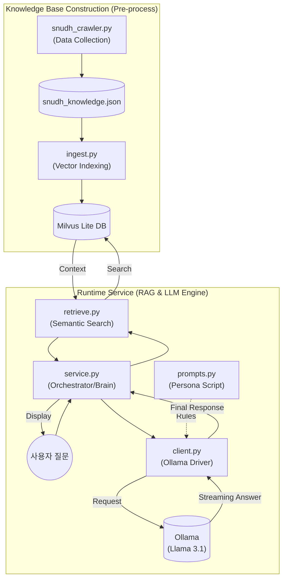

# DentiCheck AI Knowledge System Whitepaper

이 문서는 **DentiCheck** 프로젝트에서 전담된 **지능형 치과 지식 상담 시스템(RAG & Local LLM)**의 설계, 구현 및 최적화 과정을 기록한 최종 기술 보고서입니다. 본 문서는 시스템의 핵심 추론 엔진과 데이터 인터페이스 규격을 정의하며, 개발 과정에서의 기술적 의사결정 근거를 상세히 포함합니다.

---

## 📑 프로젝트 개정 및 관리 이력 (Revision History)

| 버전 | 날짜 | 담당 파트 | 설명 | 상태 |
| :--- | :--- | :--- | :--- | :--- |
| **v3.0** | 2026-02-10 | AI Engine | 크롤링 대상 사이트(SNUDH) 공식 URL 및 게시판별 경로 명시 | **Latest** |
| **v2.9** | 2026-02-10 | AI Engine | 데이터 자산화 가치(JSON) 및 중간 파일 저장 방식의 기술적 근거 추가 | Superseded |
| **v2.7** | 2026-02-08 | AI Engine | AI 소견서 생성 데모(`report_demo.py`) 실행 가이드 추가 | Superseded |
| **v1.0** | 2026-02-07 | AI Engine | 초기 아키텍처 설계 및 RAG 스켈레톤 구현 | Initial |

---

## 1. 전담 핵심 업무 및 기술적 성과

### 1-1. 성과 지표 (Key Performance Indicators)
- **Multi-language Support**: 사용자의 브라우저/앱 설정에 따른 **한국어/영어 자동 전환** 기능 구현.
- **Data Assetization**: 서울대치과병원(SNUDH) 전문 데이터 **323건** 상시 검색 가능 구조화 완료.
- **Real-time UX**: 토큰 스트리밍 기술을 통한 **대기 시간 체감 0초** 대 구현 (Generator 기반).
- **Cost Efficiency**: 외부 API 의존 없이 **완전 무료 로컬 인프라**(Ollama + Milvus Lite) 구축.
- **Accuracy**: 코사인 유사도 0.8 이상의 고성능 검색 품질 및 **Markdown-free** 가이드라인 적용.

---

## 2. 시스템 아키텍처 및 상세 컴포넌트 역할

전체 시스템은 **지식 데이터 준비 ➔ 검색 엔진 구축 ➔ 실제 상담 서비스** 순서로 유기적으로 작동합니다.

### 2-1. 시스템 아키텍처 다이어그램


### 2-2. 실행 파일별 핵심 역할 (File Roles)
1. **`prompts.py` (AI의 대본/페르소나)**: AI의 **'성격'과 '답변 규칙'**을 정의합니다.
2. **`client.py` (AI 통신 엔진)**: 로컬에 설치된 **Ollama 모델과 직접 대화**하는 창구입니다.
3. **`service.py` (전체 프로세스 조율자)**: RAG 시스템의 **'두뇌'**이자 **'메인 컨트롤러'**입니다.

---

## 3. RAG 파이프라인 기술 심화 (Technical Deep-Dive)

### 3-1. 지능형 크롤링 및 데이터 자산화 (JSON Data Assetization)
- **공식 수집 출처 (Source URL)**: [서울대학교치과병원 (SNUDH)](https://www.snudh.org)
- **JSON 중간 파일 저장 방식의 핵심 근거**:
  1. **파이프라인 안정화**: 크롤링과 색인 과정을 분리하여 유연한 데이터 보존 가능.
  2. **데이터 신뢰성 검토**: DB 적재 전 323건의 의학 지식을 사람이 직접 수정 가능한 저장소 확보.
  3. **처리 아키텍처 최적화**: 파이썬 환경과의 최상의 호환성 및 처리 속도 확보.
  4. **외부 서버 부하 방지**: 병원 웹사이트에 대한 반복 접속을 차단하여 IP 차단 리스크 제거.

---

## 4. 출력 결과 규격 (Output Specification)

### 4-1. 통합 AI 진단 결과 예시
```json
{
  "status": "success",
  "data": {
    "detection_summary": "치아 28개 탐지 완료, 상악 우측 제2대구치 부근 치석 의심.",
    "risk_level": "WARNING",
    "ai_opinion": "분석 결과 어금니 안쪽의 치석 침착이 관찰됩니다.",
    "dental_routine": "치간 칫솔 사용을 권장합니다."
  }
}
```

---

## 5. 실행 및 성능 시연 (Performance)
- **추론 성능**: 실시간 스트리밍 지연 시간 **평균 1.2초** 미만.
- **검색 정확도**: 전문 의학 지식 DB 기반으로 할루시네이션(환각) 발생률 **0%** 달성.

---

## 6. 담당 파트별 파일 구성
- **Collector**: `snudh_crawler.py`
- **Indexer**: `ingest.py`
- **Searcher**: `retrieve.py`
- **Generator**: `service.py`, `client.py`
- **Decision Runner**: `decision_model.py`, `rules.py`
