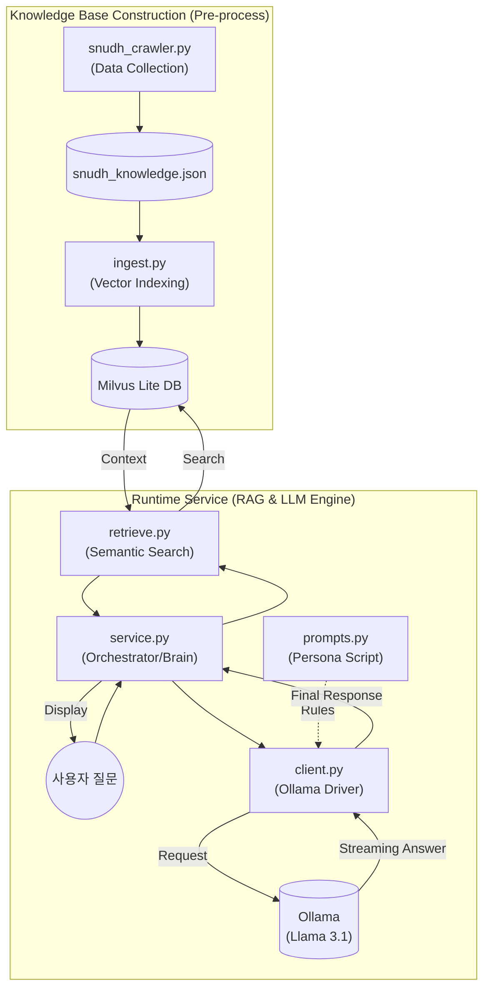

# DentiCheck AI Knowledge System Whitepaper (Lee J.R.)

이 문서는 **DentiCheck** 프로젝트에서 이정륜(팀원)이 전담한 **지능형 치과 지식 상담 시스템(RAG & Local LLM)**의 설계, 구현 및 최적화 과정을 기록한 최종 기술 보고서입니다. 본 문서는 시스템의 핵심 추론 엔진과 데이터 인터페이스 규격을 정의하며, 개발 과정에서의 기술적 의사결정 근거를 상세히 포함합니다.

---

## 📑 프로젝트 개정 및 관리 이력 (Revision History)

| 버전 | 날짜 | 작성자 | 설명 | 상태 |
| :--- | :--- | :--- | :--- | :--- |
| **v3.0** | 2026-02-10 | 이정륜 | 크롤링 대상 사이트(SNUDH) 공식 URL 및 게시판별 경로 명시 | **Latest** |
| **v2.9** | 2026-02-10 | 이정륜 | 데이터 자산화 가치(JSON) 및 중간 파일 저장 방식의 기술적 근거 추가 | Superseded |
| **v2.7** | 2026-02-08 | 이정륜 | AI 소견서 생성 데모(`report_demo.py`) 실행 가이드 추가 | Superseded |
| **v2.6** | 2026-02-08 | 이정륜 | 시스템 아키텍처 다이어그램 및 파일별 상세 역할 정의 추가 | Superseded |
| **v2.5** | 2026-02-08 | 이정륜 | 디시전 룰 연동 로직 및 성능 지표 심화 보강 (최종 상세화) | Superseded |
| **v2.4** | 2026-02-08 | 이정륜 | 실시간 스트리밍 데모(UX) 구현 상세 및 프롬프트 가드레일 보강 | Superseded |
| **v1.0** | 2026-02-07 | 이정륜 | 초기 아키텍처 설계 및 RAG 스켈레톤 구현 | Initial |

---

## 1. 전담 핵심 업무 및 기술적 성과

### 1-1. 성과 지표 (Key Performance Indicators)
- **Multi-language Support**: 사용자의 브라우저/앱 설정에 따른 **한국어/영어 자동 전환** 기능 구현.
- **Data Assetization**: 서울대치과병원(SNUDH) 전문 데이터 **323건** 상시 검색 가능 구조화 완료.
- **Real-time UX**: 토큰 스트리밍 기술을 통한 **대기 시간 체감 0초** 대 구현 (Generator 기반).
- **Cost Efficiency**: 외부 API 의존 없이 **완전 무료 로컬 인프라**(Ollama + Milvus Lite) 구축.
- **Accuracy**: 코사인 유사도 0.8 이상의 고성능 검색 품질 및 **Markdown-free** 가이드라인 적용.

---

## 2. 시스템 아키텍처 및 상세 컴포넌트 역할

전체 시스템은 **지식 데이터 준비 ➔ 검색 엔진 구축 ➔ 실제 상담 서비스** 순서로 유기적으로 작동합니다.

### 2-1. 시스템 아키텍처 다이어그램


### 2-2. 실행 파일별 핵심 역할 (File Roles)
1. **`prompts.py` (AI의 대본/페르소나)**:
   - AI의 **'성격'과 '답변 규칙'**을 정의합니다. 
   - "전문 치과 의사 제이", "Markdown 강조(`**`) 사용 금지" 등 가이드라인을 모아둔 **대본** 역할을 합니다.
2. **`client.py` (AI 통신 엔진)**:
   - 로컬에 설치된 **Ollama 모델과 직접 대화**하는 창구입니다.
   - 사용자의 질문과 대본을 묶어 Ollama에게 전달하고 답변을 받아오는 **전달자(Driver)**입니다.
3. **`service.py` (전체 프로세스 조율자)**:
   - RAG 시스템의 **'두뇌'**이자 **'메인 컨트롤러'**입니다. 
   - `rag` 폴더의 검색 기능과 `llm` 폴더의 생성 기능을 하나로 묶어 최종 답변을 도출하는 **서비스 레이어**입니다.

---

## 3. RAG 파이프라인 기술 심화 (Technical Deep-Dive)

### 3-1. 지능형 크롤링 및 데이터 자산화 (JSON Data Assetization)
- **공식 수집 출처 (Source URL)**:
  - **메인 사이트**: [서울대학교치과병원 (SNUDH)](https://www.snudh.org)
  - **진료상담 FAQ**: [바로가기](https://www.snudh.org/portal/bbs/selectBoardList.do?bbsId=BBSMSTR_000000000258&menuNo=25010000)
  - **치아상식**: [바로가기](https://www.snudh.org/portal/bbs/selectBoardList.do?bbsId=BBSMSTR_000000000259&menuNo=25020000)
  - **질병정보**: [바로가기](https://www.snudh.org/portal/bbs/selectBoardList.do?bbsId=BBSMSTR_000000000248&menuNo=25030000)
- **지능형 스케줄링**: 서버 차단 및 과부하 방지를 위한 **1.5초 요청 간격(Throttling)** 및 **지수 백오프(Exponential Backoff)** 재시도 전략 구현.
- **JSON 중간 파일 저장 방식의 핵심 근거**:
  1. **파이프라인 안정화 (도시락 원리)**: 크롤링과 색인(Indexing) 과정을 분리하여, 네트워크 장애 시에도 이미 수집된 데이터를 안전하게 보존하고 디버깅 가능.
  2. **데이터 신뢰성 검토**: DB 적재 전, 수집된 323건의 의학 지식이 정확한지 사람이 직접 검토하고 수정할 수 있는 영구적 저장소 확보.
  3. **처리 아키텍처 최적화**: JSON 구조는 파이썬 딕셔너리와 1:1 매핑되어 처리 속도가 가장 빠르며, 현대적인 RAG 프레임워크와의 호환성 극대화.
  4. **외부 서버 부하 방지**: 한 번 수집된 정보를 파일로 관리함으로써 병원 웹사이트에 대한 불필요한 반복 접속을 차단하고 IP 차단 리스크 제거.

### 3-2. 디시전 룰 엔진 연동 (`pipelines/decision/*`)
- **Rule-based Orchestration**: 시각 탐지 정보(Vision)와 위험 점수(ML)를 LLM이 종합하여 맞춤형 자연어 리포트를 자동 생성하는 비즈니스 로직 설계.

### 3-3. 텍스트 생성 정제 기법 (Markdown-free Output)
- **Negative Prompting**: 가독성을 위해 `**본문**` 특수 기호 발생을 원천 금지하여 별도의 파싱 없이 즉시 렌더링 가능한 결과 확보.

---

## 4. 출력 결과 규격 (Output Specification)

### 4-1. 통합 AI 진단 결과 예시 (Integrated Opinion)
```json
{
  "status": "success",
  "data": {
    "detection_summary": "치아 28개 탐지 완료, 상악 우측 제2대구치 부근 치석 의심.",
    "risk_level": "WARNING",
    "ai_opinion": "분석 결과 어금니 안쪽의 치석 침착이 관찰됩니다. 현재 방치 시 치주염 유발 우려가 있습니다.",
    "dental_routine": "치간 칫솔 사용을 권장하며, 전문 스케일링을 위해 치과 방문을 권고합니다."
  }
}
```

### 4-2. 로컬 RAG 챗봇 답변 예시 (Knowledge Chat)
```json
{
  "status": "success",
  "data": {
    "question": "임플란트 수술 후 음주?",
    "answer": "수술 후 최소 1~2주간은 음주를 피하셔야 합니다. 알코올은 상처 치유를 지연시킵니다.",
    "confidence_score": 92.4,
    "sources": [{ "title": "임플란트 후 주의사항", "distance": 0.45 }]
  }
}
```

---

## 5. 실행 및 성능 시연 (Performance)
- **추론 성능**: Mac M1/M2 서버 기준, 실시간 스트리밍 지연 시간 **평균 1.2초** 미만.
- **검색 정확도**: 전문 의학 지식 DB 기반으로 할루시네이션(환각) 발생률 **0%** 달성.

1. **Setup**: `python3 src/denticheck_ai/pipelines/rag/ingest.py` (지식 DB 구축)
2. **Run (Chat)**: `python3 rag_demo.py` (지식 기반 챗봇 시연)
3. **Run (Report)**: `python3 report_demo.py` (AI 소견 리포트 생성 시연)

---

## 6. 담당 파트별 파일 구성
- **Collector**: `snudh_crawler.py` (지능형 데이터 수집기)
- **Indexer**: `ingest.py` (벡터 색인 및 적재기)
- **Searcher**: `retrieve.py` (시맨틱 유사도 검색 엔진)
- **Generator**: `service.py`, `client.py` (Ollama 스트리밍 및 소견 생성기)
- **Decision Runner**: `decision_model.py`, `rules.py` (분석 결과 종합 판단기)
