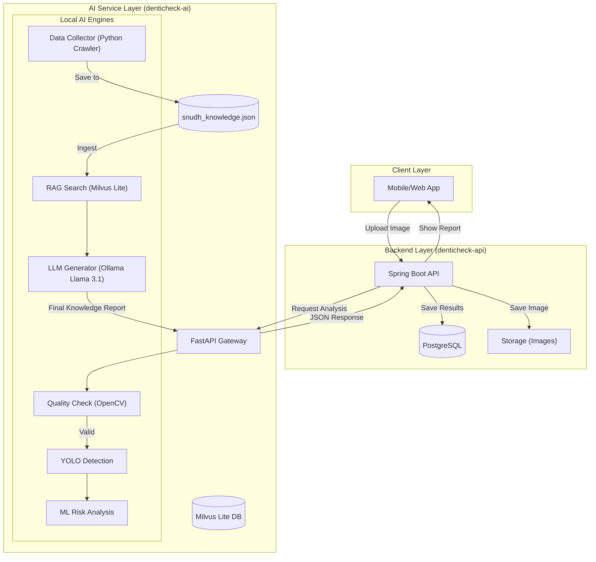

# DentiCheck AI System Whitepaper

이 문서는 **DentiCheck** 프로젝트의 AI 파이프라인 및 백엔드 도메인의 기술 명세와 변천사를 기록한 시스템 백서입니다.

---

## 📑 개정 이력 (Revision History)

| 버전 | 날짜 | 작성자 | 설명 | 상태 |
| :--- | :--- | :--- | :--- | :--- |
| **v1.2** | 2026-02-08 | 이정륜 | 크롤러 명세 통합, Ollama(Llama 3.1) 연동 및 완전 로컬 RAG 시스템 완성 | **Latest** |
| **v1.1** | 2026-02-07 | 이정륜 | 로컬 RAG 파이프라인(Milvus Lite) 구축 및 아키텍처 상세화 | Superseded |
| **v1.0** | 2026-01-15 | 이정륜 | 초기 아키텍처 설계 및 Decision Logic 스켈레톤 구현 | Superseded |

---

## 1. 시스템 아키텍처 (System Architecture)

전체 서비스의 데이터 흐름과 컴포넌트 간 상호작용은 다음과 같습니다. 본 시스템은 보안과 비용 효율성을 위해 **100% 로컬 인퍼런스**를 지향합니다.



---

## 2. 주요 모듈별 상세 명세

### 2-1. 데이터 수집 엔진 (Knowledge Collector)
- **목적**: 서울대학교 치과병원(SNUDH)의 신뢰할 수 있는 구강 건강 정보를 수집하여 지식 베이스 구축.
- **수집 데이터**: FAQ(145건), 치아상식(142건), 질병정보(36건) 등 총 **323건** 확보.
- **작동 방식**: BeautifulSoup4 기반 정밀 파싱 및 안정적인 수집을 위한 **지수 백오프(Exponential Backoff)** 및 자동 재시도 로직 적용.
- **데이터 보관**: 수집된 데이터는 `data/snudh_knowledge.json`에 보관되어 네트워크 장애와 관계없이 안정적인 파이프라인 운영 가능.

### 2-2. 지식 엔진 (RAG Pipeline)
- **목적**: 수집된 전문 지식을 바탕으로 할루시네이션 없는 AI 상담 제공.
- **로컬 임베딩**: `jhgan/ko-sroberta-multitask` 모델을 사용하여 CPU 환경에서 텍스트를 벡터화.
- **벡터 검색**: `Milvus Lite`를 활용해 질문과 가장 유사한 지식 조각(`Top-K`)을 거리 기반 점수와 함께 추출.
- **신뢰도 산출**: 유클리드 거리 점수를 백분율(%)로 변환하여 사용자에게 답변의 근거 수준을 제시.

### 2-3. 생성 엔진 (LLM Generation)
- **엔진**: `Ollama` 기반 `Llama 3.1 (8B)` 모델 사용.
- **특징**: 외부 API 비용 0원, 인터넷 연결 불필요, 데이터 외부 유출 차단.
- **페르소나**: 친절한 치과 의사 말투를 적용하여 검색된 지식을 바탕으로 자연스러운 한국어/영어 답변 생성 가능.

### 2-4. 판정 엔진 (Decision Core)
- **위치**: `src/denticheck_ai/pipelines/decision/rules.py`
- **로직**: 다중 모델 분석 결과(탐지 데이터 + 위험도 점수)를 룰 엔진으로 결합하여 최종 진단 리포트 구성.

---

## 3. 작업 로드맵 (Roadmap)

### ✅ 완료된 작업 (Completed)
- [x] 서울대치과병원 지식 데이터 전수 수집 (323건) 및 크롤러 명세화
- [x] Milvus Lite 기반 로컬 지식 베이스 구축
- [x] Ollama(Llama 3.1) 연동 및 RAG 통합 서비스 구현
- [x] 지식 검색 신뢰도 산출 로직 적용

### 🚩 [Phase 1] 필수 구현 과제 (Short-term)
- **이미지 품질 필터링 (QC)**: OpenCV를 활용한 초점/밝기 체크 로직 실구현.
- **YOLOv8 실제 추론 연동**: 현재 가짜 데이터인 탐지 로직을 학습된 실모델 가중치로 보완.
- **ML 위험도 모델 연동**: 치주염 위험도 수치 분류 모델 탑재.

### 🛠 [Phase 2] 시스템 고도화 과제 (Mid-term)
- **다국어 서비스 지원**: 설정 항목에서 한국어/영어 페르소나를 유연하게 전환하는 기능.
- **리포트 양식 정교화**: 분석 수치를 시각화하고 사용자 맞춤형 가이드를 생성하는 프롬프트 튜닝.
- **Java-Python 통합 테스트**: 백엔드 API와의 엔드-투-엔드 연동 완성.

---

## 4. 출력 결과 규격 (Output Specification)

AI 서비스가 최종적으로 반환하는 데이터 구조는 다음과 같습니다. 프론트엔드 및 백엔드 연동 시 이 규격에 맞춰 데이터를 처리합니다.

### 4-1. 최종 응답 JSON 명세 (API Spec)
> [!NOTE]
> 아래 구조는 향후 프론트엔드/백엔드 연동 시 사용될 **표준 응답 규격**입니다. `confidence_score`는 Milvus의 거리(Distance) 값을 기반으로 자체 산출된 신뢰도 지수(%)입니다.

```json
{
  "status": "success",
  "data": {
    "question": "임플란트 수술 후 술 마셔도 되나요?",
    "answer": "임플란트 수술 후 음주는 반드시 피하셔야 합니다. 알코올은 혈액 순환을 빨라지게 하여 수술 부위의 지혈을 방해하고, 염증 발생 가능성을 크게 높입니다. 최소 2주일간은 금주하시는 것이 임플란트가 잇몸뼈에 잘 자리잡는 데 필수적입니다. 정확한 진단은 치과 방문을 직접 권장드립니다.",
    "confidence_score": 78.5,
    "sources": [
      {
        "title": "임플란트 시술 후 주의사항",
        "content": "수술 후 약 1~2주일간은 음주 및 흡연을 금하셔야 합니다. 이는 지혈 방해 및 염증 발생의 주요 원인이 됩니다.",
        "distance": 0.655
      },
      {
        "title": "시술 후 빠른 회복을 위한 가이드",
        "content": "충분한 휴식과 함께 처방된 약을 복용하시고 술, 담배 등 자극적인 음식은 피하십시오.",
        "distance": 0.812
      }
    ]
  }
}
```

#### ※ 신뢰도(Confidence) 산출 공식
본 시스템은 정규화된 벡터 환경에서 Milvus의 L2 거리 점수를 **코사인 유사도(Cosine Similarity)**로 변환하여 신뢰도를 산출합니다:
- **공식**: $Confidence(\%) = (1 - \frac{Distance^2}{2}) \times 100$
- **의미**: 
    - 100%에 가까울수록 질문과 지식 베이스의 내용이 의미적으로 거의 일치함을 의미합니다.
    - 보통 70~80% 이상의 신뢰도를 가진 문서를 기반으로 답변을 생성할 때 가장 정확도가 높습니다.

---

## 5. 실행 및 테스트 가이드 (Testing & Execution)

전체 RAG 시스템을 로컬 환경에서 구동하기 위한 3단계 가이드입니다.

### Step 1: 로컬 LLM 환경 설정 (Ollama)
프로젝트 구동 전, 로컬에 [Ollama](https://ollama.com/)가 설치되어 있어야 합니다.
```bash
# 1-1. Ollama를 통해 Llama 3.1 모델을 다운로드합니다.
ollama pull llama3.1

# 1-2. Ollama 서비스가 실행 중인지 확인합니다. (Mac의 경우 상단 메뉴바 아이콘 확인)
```

### Step 2: 지식 베이스 구축 (Data Ingestion)
크롤링된 데이터를 기반으로 Milvus Lite 벡터 DB를 생성합니다. (최초 1회 필수)
```bash
# PYTHONPATH 설정 (패키지 임포트 오류 방지)
export PYTHONPATH=$PYTHONPATH:.

# 데이터 적재 스크립트 실행
python3 src/denticheck_ai/pipelines/rag/ingest.py
```
> [!TIP]
> 실행 후 `data/milvus_dental.db` 파일이 성공적으로 생성되었는지 확인하세요.

### Step 3: 통합 RAG 데모 실행 (Full Pipeline Test)
지식 검색과 AI 답변 생성이 결합된 전체 프로세스를 테스트합니다.
```bash
# 통합 데모 실행
export PYTHONPATH=$PYTHONPATH:.
python3 rag_demo.py
```
- **대화형 인터페이스**: 질문을 입력하면 실시간 스트리밍으로 AI 답변이 출력됩니다.
- **종료 방법**: `exit` 또는 `q`를 입력하여 종료합니다.

---

## 6. 협업 및 보안 지침
- 모든 코드는 `feature/rag-ollama-integration` 브랜치에 우선 반영됩니다.
- 보안이 필요한 환경 변수는 `.env`에서 관리하며, 외부에 절대 노출되지 않도록 주의합니다.
- 로컬 데이터베이스 파일(`.db`) 및 로그 파일은 `.gitignore`에 등록되어 저장소에 포함되지 않습니다.
