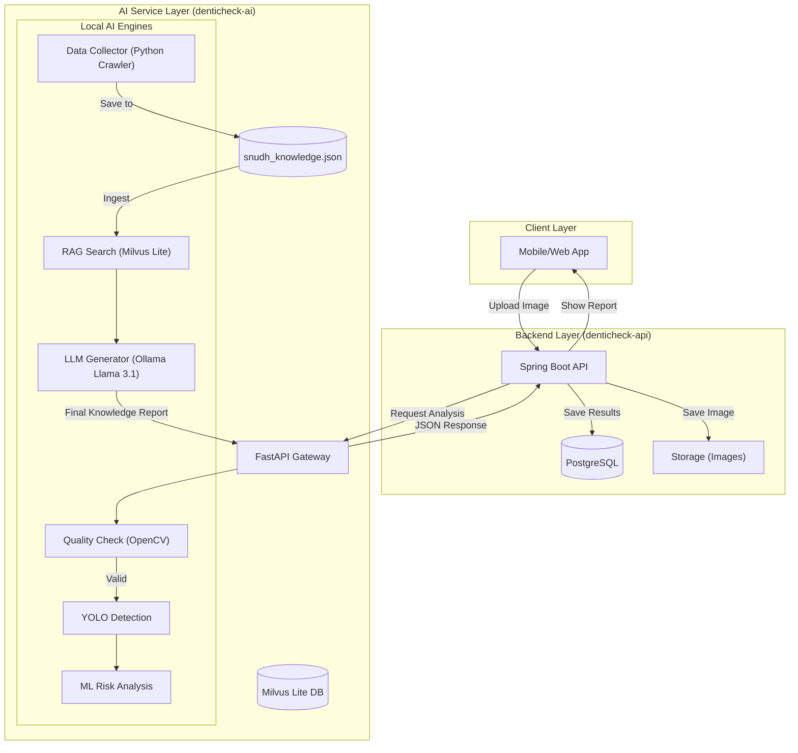

# DentiCheck AI System Whitepaper

이 문서는 **DentiCheck** 프로젝트의 AI 파이프라인 및 백엔드 도메인의 기술 명세와 협업 가이드라인을 기록한 시스템 백서입니다.

---

## 📑 개정 이력 (Revision History)

| 버전 | 날짜 | 작성자 | 설명 | 상태 |
| :--- | :--- | :--- | :--- | :--- |
| **v1.3** | 2026-02-08 | 이정륜 | 팀 역할 분담, 백엔드 상세 구현 명세 및 협업 가이드라인 추가 | **Latest** |
| **v1.2** | 2026-02-08 | 이정륜 | 크롤러 명세 통합, Ollama(Llama 3.1) 연동 및 로컬 RAG 시스템 완성 | Superseded |

---

## 0. 팀 역할 분담 (Role Distribution)

- **프론트 (Figma/App)**: 이승윤
- **AI (YOLO/Detection)**: 강진용
- **AI (LLM/RAG/Docs)**: 이정륜
- **AI (ML/Risk/Data)**: 하요한
- **백엔드 (SpringBoot/GraphQL/REST)**: 페이지별 분담
- **개발 지원 (DevOps)**: 추호연

---

## 1. 시스템 아키텍처 및 동작 순서

### 1-1. 아키텍처 다이어그램


### 1-2. 파일별 동작 순서 (Workflow)
1. **`snudh_crawler.py`**: 서울대치과병원 웹사이트에서 원천 지식 데이터를 수집하여 `data/snudh_knowledge.json`으로 저장.
2. **`ingest.py`**: 수집된 JSON 데이터를 불러와 로컬 임베딩(`ko-sroberta`) 후 `Milvus Lite` 벡터 DB에 적재.
3. **`retrieve.py`**: 사용자 질문을 벡터화하여 가장 유사한 지식 조각과 코사인 유사도 기반 신뢰도 점수를 검색.
4. **`service.py`**: 검색된 지식을 `Ollama(Llama 3.1)`에 주입하여 최종적인 지능형 답변을 생성하는 서비스 레이어.
5. **`rag_demo.py`**: 위 모든 과정을 한 번에 테스트할 수 있는 실시간 스트리밍 데모 인터페이스.

---

## 2. 백엔드 구현 범위 및 전략

### 2-1. 기술 스택 및 통신
- **GraphQL**: 사용자 앱 + 관리자 콘솔 공통 API (권장)
- **REST API**:
    - 이미지 업로드 (Pre-signed URL 발급)
    - LLM 스트리밍 응답 (SSE: Server-Sent Events)
    - 내부 연동 (Spring Boot ➔ FastAPI 추론기 로컬 통신)

### 2-2. 공통 기반 기술
- **프로파일(profile)**: `local/dev/prod` 설정 분리
- **DB 마이그레이션**: Flyway를 활용한 스키마 버전 관리 (`V1__init.sql` ...)
- **에러 처리**: `ErrorCode`, `ApiException`, `GlobalExceptionHandler` 적용
- **로깅**: `@Slf4j` + MDC 기반의 requestId 추적 및 외부 호출 로그 마스킹

---

## 3. 도메인별 구현 목록

### 3-1. AI Check (핵심 분석 파이프라인)
- **구현**: 업로드 URL 발급 ➔ Job 생성/상태 관리 ➔ AI 호출 ➔ 결과 통합 저장.
- **저장**: `ai_check_job`, `ai_check_image`, `ai_check_detection`, `ai_check_risk`, `ai_check_summary`.
- **구성**: 
  - 방식 A: `api → ai/quality` 호출 후 부적합 시 "재촬영 안내".
  - 방식 B: 최소 품질은 앱에서 1차, 서버에서 2차 검증.

### 3-2. Knowledge Chat (지능형 상담)
- **구현**: 세션 관리, **근거 문서 기반 답변 강제**, 상담 권장 가드레일 로직.
- **저장**: `chat_session`, `chat_message`, `knowledge_document`.
- **통신**: REST(SSE) 기반 실시간 스트리밍 답변 제공.

### 3-3. 기타 도메인
- **Auth/User**: JWT 기반 인증/인가, 회원 탈퇴(논리 삭제).
- **Consent**: 단계적 약관 동의 버전 관리.
- **Survey**: 구강 설문 응답 및 점수 산정 로직.
- **Hospital/Review**: 공공데이터 동기화, 거리순 검색, TAG 기반 리뷰 및 평점 집계.
- **Community**: 게시글/댓글/좋아요 및 관리자 모더레이션.

---

## 4. 협업 운영 및 코드 컨벤션

### 4-1. 오너십 맵 (Ownership Map)
- **AI 팀 (하요한, 강진용, 이정륜)**
    - `denticheck-ai` 리포지토리 전체
    - API 내 `ai_check`, `knowledge` 도메인 및 외부 연동 클라이언트 (`AiClient`, `MilvusClient`)
- **Core 팀 (이승윤, 추호연)**
    - API 내 `user`, `consent`, `survey`, `hospital`, `review`, `community` 도메인
    - 보안(`Security`), DB 마이그레이션, 공공데이터 클라이언트

### 4-2. 운영 경계 (Boundaries)
- **DB 쓰기 주체**: DB 물리 쓰기는 **`denticheck-api`**만 수행합니다. AI는 추론 결과만 JSON으로 반환합니다.
- **이미지 전달**: 서비스 간 대용량 바이너리 직접 전달 금지. `storageKey` 또는 `Pre-signed URL`만 교환합니다.
- **통신 계약**: API ➔ AI 연동은 **REST + JSON**으로 고정하며, 스펙 변경 시 양팀 동의가 필요합니다.

### 4-3. 코드 컨벤션
- **서비스 구조**: `XxxService` 인터페이스 + `XxxServiceImpl` 구현체 분리.
- **Dto 규칙**: GraphQL(`Input/Payload`), 내부(`Command/Result`), AI연동(`AiRequest/Response`).
- **Lombok**: `@Getter`, `@Builder`, `@RequiredArgsConstructor` 적극 활용 (Setter 사용 금지).

---

## 5. 출력 결과 규격 (Output Specification)

### 5-1. AI Check 최종 소견 (LLM Summary Report)
사진 분석 결과(YOLO/ML)를 바탕으로 생성되는 종합 레포트 규격입니다.
```json
{
  "status": "success",
  "data": {
    "detection_summary": "치아 28개 탐지 완료, 상악 우측 제2대구치(17번) 부근 치석 의심.",
    "risk_level": "WARNING",
    "risk_score": 85.2,
    "ai_opinion": "탐지된 영상 분석 결과, 어금니 안쪽의 치석 침착이 관찰됩니다. 현재 방치 시 치주염으로 발전할 가능성이 높습니다.",
    "dental_routine": "치간 칫솔 사용을 생활화하고, 1주일 내 스케일링을 위해 치과 방문을 권장합니다."
  }
}
```

### 5-2. 로컬 RAG 챗봇 답변 (Knowledge Chat Result)
검색된 지식을 기반으로 실시간 스트리밍되는 지식 답변 규격입니다.
```json
{
  "status": "success",
  "data": {
    "question": "교정하려면 꼭 이를 발치해야 하나요?",
    "answer": "치아 교정 시 발치 여부는 구강 내 공간 확보 정도에 따라 달라집니다. 치아가 배열될 공간이 많이 부족한 경우...",
    "confidence_score": 75.5,
    "sources": [
      {
        "title": "교정 치료와 발치 안내",
        "url": "https://snudh.org/knowledge/102",
        "distance": 0.7
      }
    ]
  }
}
```

---

## 6. 실행 가이드 (Execution)
1. **Ollama 모델 다운로드**: `ollama pull llama3.1`
2. **지식 베이스 구축**: `python3 src/denticheck_ai/pipelines/rag/ingest.py`
3. **통합 데모 실행**: `python3 rag_demo.py` (스트리밍 답변 확인 가능)
