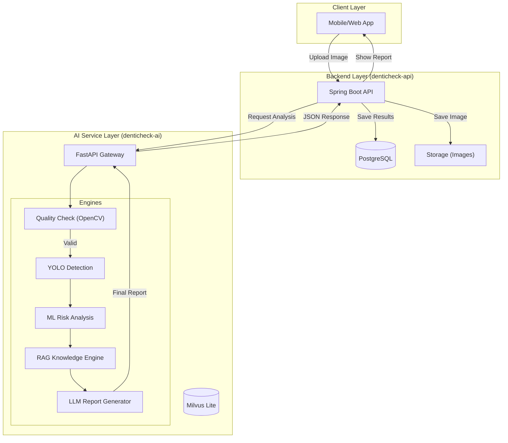

# DentiCheck AI System Whitepaper & Handover

이 문서는 **DentiCheck** 프로젝트의 AI 파이프라인 및 백엔드 도메인의 기술 명세와 변천사를 기록한 시스템 백서입니다.

---

## 📑 개정 이력 (Revision History)

| 버전 | 날짜 | 작성자 | 설명 | 상태 |
| :--- | :--- | :--- | :--- | :--- |
| **v1.1** | 2026-02-07 | 이정륜 | 로컬 RAG 파이프라인 완성, 상세 아키텍처 및 로드맵 상세화 | **Latest** |
| **v1.0** | 2026-01-15 | 이정륜 | 초기 아키텍처 설계 및 Decision Logic 스켈레톤 구현 | Superseded |

---

## 1. 시스템 아키텍처 (System Architecture)

전체 서비스의 데이터 흐름과 컴포넌트 간 상호작용은 다음과 같습니다.

---

## 2. 주요 모듈별 상세 명세

### 2-1. 지식 엔진 (RAG Pipeline)
- **목적**: 전문 치과 지식을 바탕으로 할루시네이션 없는 AI 답변 생성
- **데이터 흐름**: 질문 ➔ `ko-sroberta` 로컬 임베딩 ➔ `Milvus Lite` 로컬 검색 ➔ 검색된 컨텍스트 기반 GPT-4 리포트 생성
- **보안**: 로컬 임베딩 모델 사용으로 검색 질의어가 외부로 유출되지 않음 (Privacy-First)

### 2-2. 판정 엔진 (Decision Core)
- **위치**: `src/denticheck_ai/pipelines/decision/rules.py`
- **로직**: 다중 모델 분석 결과(객체 탐지 + 위험도 점수)를 룰 엔진으로 결합하여 "병원 방문 필요성"을 최종 판단

---

## 3. 향후 작업 로드맵 (Future Roadmap)

작업의 성격에 따라 세 단계로 구분하여 관리합니다.

### 🚩 [Phase 1] 필수 구현 과제 (Short-term)
- **YOLOv8 실제 추론 연동**: 현재 Mock인 탐지 로직을 학습된 실모델 가중치로 교체
- **ML 위험도 모델 연동**: Scikit-learn 등으로 학습된 치주염 위험도 분류 모델 탑재
- **OpenCV 품질 필터링**: 사진의 밝기, 초점, 각도를 체크하여 "다시 촬영" 가이드 제공

### 🛠 [Phase 2] 시스템 고도화 과제 (Mid-term)
- **리포트 생성 고도화**: RAG 검색 결과와 수치 데이터를 결합한 커스텀 리포트 양식 정교화
- **비동기 처리 도입**: 분석 시간이 길어질 경우를 대비해 Celery/Redis 기반 비동기 작업 큐 도입
- **Java-Python 데이터 동기화**: `denticheck-api`와 `denticheck-ai` 간의 인터페이스 최적화

### 🧪 [Phase 3] 심화 연구 과제 (Long-term)
- **Foxit API PDF 연동**: 생성된 AI 리포트를 공식 PDF 문서 형태로 자동 출력
- **멀티모달 학습**: 이미지와 사용자의 주관적 통증 데이터를 동시에 학습하는 모델 연구
- **모델 경량화**: 모바일 기기 내부(On-device)에서 일부 분석이 가능하도록 모델 최적화

---

## 4. 인프라 및 배포 전략

- **API/DB**: AWS ECS 또는 Linode 배포 (Docker Compose 기반)
- **AI Service**: CPU 기반 로컬 임베딩 최적화 (Milvus Lite 활용)
- **환경 변수**: 보안이 필요한 `OPENAI_API_KEY`는 `.env` 파일로 로컬 관리하며 저장소에서 제외

---

## 5. 협업 규칙 & 문서 관리
- 시스템 백서는 버전 **v1.1**을 기준으로 하며, 주요 아키텍처 변경 시 차기 버전을 공시함
- 모든 코드는 `feature/` 브랜치를 통해 리뷰 후 `develop`으로 머지함
