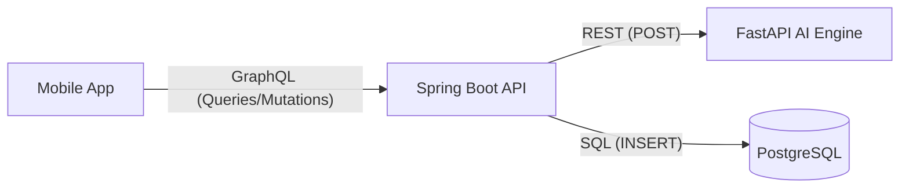

# DentiCheck AI Integration Guide (GraphQL Edition)

백엔드 서버가 **GraphQL**을 사용할 때, AI 엔진과 DB를 연결하는 최적의 아키텍처를 설명합니다.

---

## 🏗️ 1. 데이터 흐름 (GraphQL Proxy)
백엔드 서버가 '중계기' 역할을 하며 보안과 데이터 저장을 동시에 처리합니다.



---

## 🧩 2. 백엔드 구현 사양

### A. GraphQL 스키마 정의 (`schema.graphqls`)
앱 개발자가 사용할 수 있도록 백엔드에서 아래와 같이 스키마를 정의합니다.

```graphql
type Query {
    # AI 챗봇 상담
    aiChat(sessionId: ID!, question: String!, language: String): AiChatResponse!
}

type Mutation {
    # AI 소견서 생성 및 저장
    generateAiReport(sessionId: ID!, riskLevel: String!, detections: String!, actions: String!, language: String): AiReportResponse!
}

type AiChatResponse {
    answer: String!
    language: String!
}

type AiReportResponse {
    report: String!
    language: String!
}
```

### B. 리졸버(Resolver) 연동 로직 예시
백엔드 담당자가 작성할 핵심 "연결" 코드입니다.

```java
@Controller
public class AiResolver {

    @Autowired
    private RestTemplate restTemplate; // AI 서버와 통신용
    @Autowired
    private AiRepository aiRepository; // DB 저장용

    // 1. 챗봇 리졸버 (Query Mapping)
    @QueryMapping
    public Map<String, Object> aiChat(@Argument String question, @Argument String language) {
        // AI 엔진 호출
        AiChatRes res = restTemplate.postForObject("http://ai-server:8000/v1/chat/ask", new ChatReq(question, language), AiChatRes.class);
        
        // [중요] DB에 대화 내역 저장 (ai_chat_messages 테이블)
        saveChatMessageToDb(question, res.getAnswer(), language);
        
        return Map.of("answer", res.getAnswer(), "language", language);
    }

    // 2. 소견서 리졸버 (Mutation Mapping)
    @MutationMapping
    public Map<String, Object> generateAiReport(
            @Argument UUID sessionId,
            @Argument String riskLevel,
            @Argument String detections,
            @Argument String actions,
            @Argument String language) {
        
        // AI 엔진 호출 (POST /v1/report/generate)
        ReportReq req = new ReportReq(riskLevel, detections, actions, language);
        AiReportRes res = restTemplate.postForObject("http://ai-server:8000/v1/report/generate", req, AiReportRes.class);
        
        // [핵심] DB에 소견서 내용 저장 (ai_reports 테이블)
        // AI가 응답한 'report' 텍스트를 파싱하거나 그대로 저장합니다.
        AiReportEntity report = AiReportEntity.builder()
                .sessionId(sessionId)
                .summary(res.getReport()) // AI의 상세 소견
                .routine_guide(actions)   -- 추천 행동을 가이드로 저장
                .language(language)
                .build();
        aiRepository.save(report);
        
        return Map.of("report", res.getReport(), "language", language);
    }
}
```

---

## 🛠️ 3. 백엔드 담당자에게 전달할 핵심 요약

1.  **AI 서버**: 포트 `8000`번에서 REST API로 대기 중입니다.
2.  **데이터 저장**: AI가 준 답변을 그대로 앱에 보내기만 하지 말고, **우리가 정의한 SQL 테이블(`ai_reports`, `ai_chat_messages`)에 저장**한 뒤 반환해 주세요.
3.  **다국어**: 앱에서 오는 `language` 파라미터를 AI 서버로 전달해 주면 한/영 답변이 바뀝니다.

---

💡 **결론**: 앱은 **GraphQL**을 통해 백엔드를 '비서'처럼 부리고, 백엔드는 **REST**로 AI에게 물어본 뒤 결과를 **DB**에 기록하고 다시 앱에게 알려주는 구조입니다.
